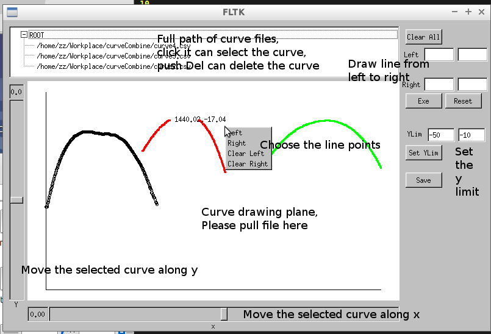

# README - curves combine version 0.1

## 简介

该软件主要用于不同曲线的拼接，是根据客户的需求完成的一项软件。

## 安装说明

目前该软件的版本只针对linux用户。该软件的GUI是基于FLTK库完成的。因此在安装该软件之前首先需要安装相应的FLTK库，该库可以在[官方网站下载](http://www.fltk.org/index.php)。相应的安装过程可参见下载的安装包中的README文件。

完成FLTK库安装之后，在Makefile.MYFLTK文件中，将头文件的目录（如：-I/usr/local/include）和库目录（如：-L/usr/local/lib）更改为自己的目录即可。

然后执行 `make`，即可生成执行文件`curveCombine`。

## 使用说明

## 其他

`*.cpp, *.h` 为源文件
`*.fl` 为fluid编辑生成的界面文件
`*.csv` 为curve的数据文件

## Bug

1. 当曲线数量多余三条时，鼠标所在点显示的坐标信息可能不正确。
